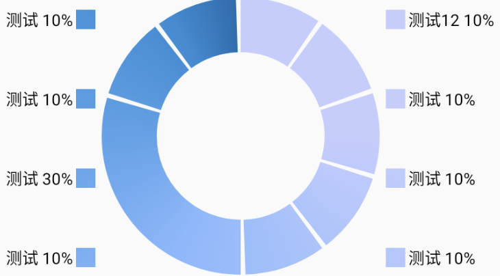

# ReadMe
使用说明

奇怪的控件仓库

 看不到图片的参考[这个方法](https://blog.csdn.net/qq_38232598/article/details/91346392)

- 引入方式

```groovy
//1.0.0可替换为最新版本
implementation 'com.github.Lo-Heng:widgets:1.0.0'
```

## widgets

### pieChartView


二维饼图工具，可以画一个饼图，中间有缝隙，四周也有图例，特色是支持渐变色，可以选择一圈渐变，可以单个色块渐变，也可以不渐变。

目前支持以下api:

#### 设置旋转角度

- **rotateAngle** 角度
- 0度是3点钟方向，默认的-90，如果需要旋转图形请在此设置旋转的角度
```java
pieChartView.setRotateAngle(rotateAngle)
```

#### 是否显示图例
- **showLegend：** 是否显示图例
```java
pieChartView.setShowLegend(showLegend)
```

#### 初始化数据方式（两种）：1种是纯色 ，2是渐变色

```java
/**
* 更新数据 1
* @param rateList  色块占比
* @param colorList 色块颜色
* @param nameList  色块名称
*/
void updateData(List<Float> rateList, int[] colorList, List<String> nameList)

/**
* 更新数据 2
* @param rateList  色块占比
* @param gradientColors 色块颜色(渐变)
* @param nameList  色块名称
*/
public void updateData(List<Float> rateList, List<int[]> gradientColors, List<String> nameList)
```
